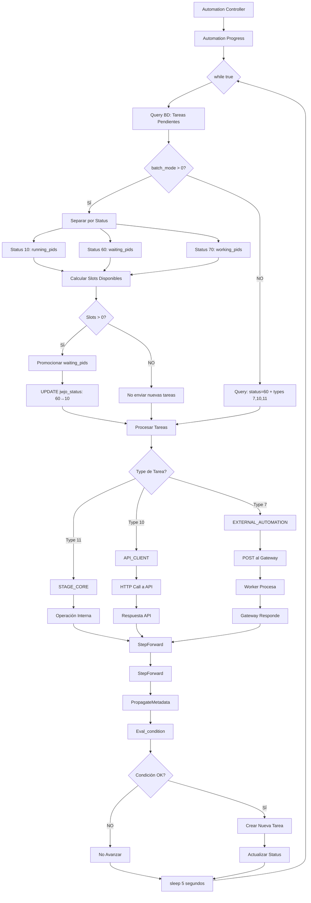
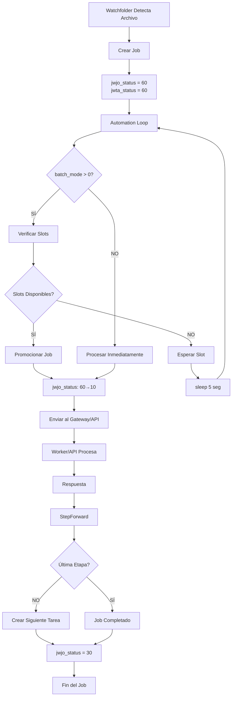
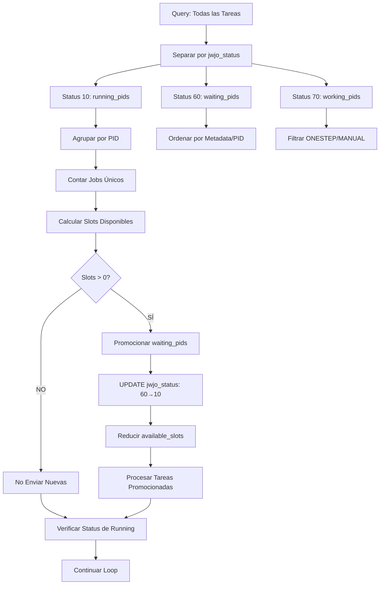
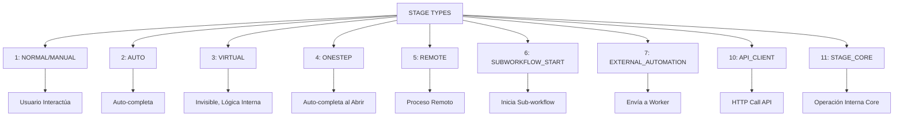
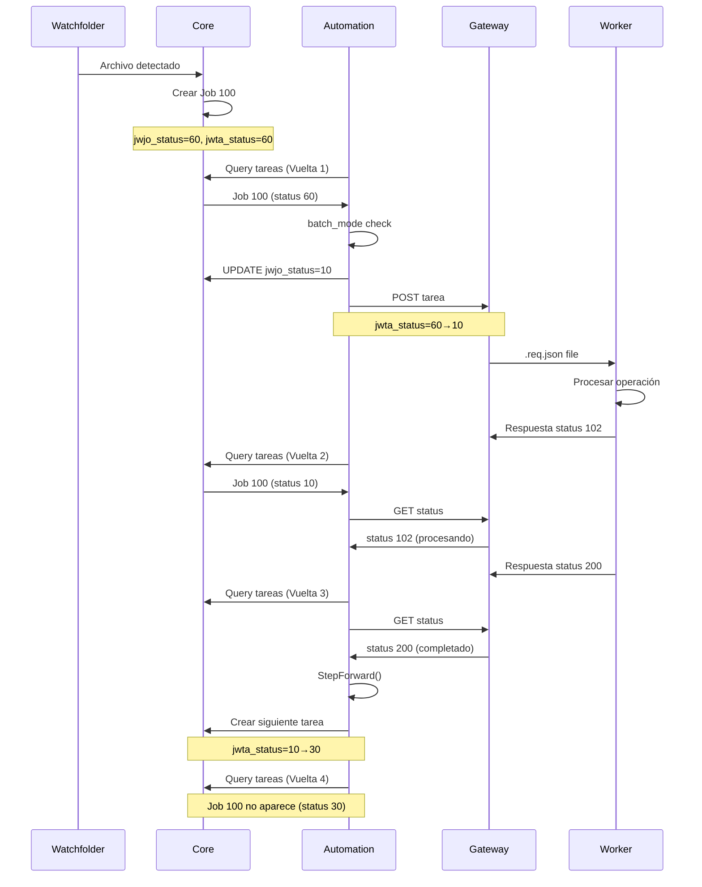
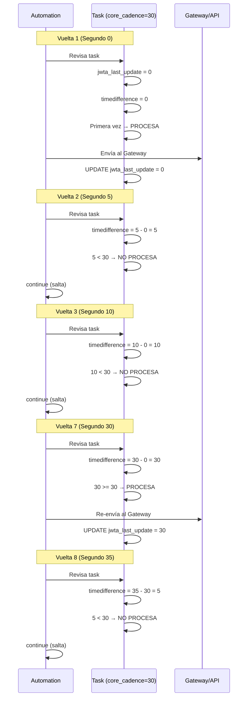

# DIAGRAMA COMPLETO DEL AUTOMATION - JOBS WORKFLOW

## FLUJO PRINCIPAL DEL AUTOMATION



## CICLO DE VIDA DE UN JOB



## BATCH MODE - CONTROL DE CONCURRENCIA



## STAGE TYPES



## FLUJO COMPLETO CON EJEMPLO



## TIMELINE DE UNA VUELTA DEL AUTOMATION

```mermaid
gantt
    title Vuelta del Automation (5 segundos)
    dateFormat X
    axisFormat %L
    
    section Query BD
    Consulta tareas pendientes    :0, 100
    
    section Batch Mode
    Separar por status           :100, 200
    Calcular slots               :200, 300
    Promocionar waiting          :300, 400
    
    section Procesar
    Enviar al Gateway            :400, 800
    Consultar status             :800, 1200
    StepForward                  :1200, 1400
    
    section Finalizar
    Cerrar conexión BD           :1400, 1500
    sleep 5 segundos             :1500, 5000
```



## CORE CADENCE - CONTROL DE FRECUENCIA



## RESUMEN DE CONCEPTOS CLAVE

### JERARQUÍA FUNDAMENTAL
```
PROCESS (Workflow)
    └─ STAGES (Etapas/Plantillas) - Se definen 1 vez
        └─ JOBS (PIDs) - 1 por cada archivo
            └─ TASKS (Instancias) - Se crean "just in time"
```

### Process vs Job vs Stage vs Task
- **PROCESS**: Workflow completo (ej: "ESPN DR Playlist", ID: 12)
- **STAGE**: Plantilla de una etapa (ej: "Leer archivo", ID: 5, existe 1 vez)
- **JOB**: Instancia del workflow (ej: Job 100, cuando llega un archivo)
- **TASK**: Instancia de una STAGE para un JOB (ej: Task 5001 = Job 100 en Stage 5)

**CLAVE**: Las tasks NO existen todas desde el inicio. Se crean cuando el job LLEGA a esa stage.

### Automation Controller
- Proceso maestro que gestiona child processes
- **1 Automation Progress por cada PROCESS (workflow)**
- Monitorea y reinicia procesos hijos
- Comando: `php jwf_automation_progress.php --process 12`

### Automation Progress
- **1 proceso hijo por workflow**
- Query cada 5 segundos: `WHERE jwst_process = [su_proceso]`
- Procesa SOLO tareas de su proceso
- Procesos en paralelo independientes

### Batch Mode
- Control de concurrencia **por JOBS, no por tareas**
- Limita cantidad de jobs simultáneos **dentro de cada proceso**
- Ordena por metadata o PID
- Un job con 10 tareas cuenta como 1 slot
- Cada proceso tiene su propio batch_mode

### Core Cadence
- **Intervalo de tiempo** (segundos) entre re-ejecuciones
- Se usa en Type 7 (EXTERNAL_AUTOMATION) y Type 10 (API_CLIENT)
- El Core verifica ANTES de enviar al Gateway/API
- Si no pasó suficiente tiempo → `continue` (salta)
- Útil para POLLING: consultar estado cada X segundos
- Ejemplo: `core_cadence: 60` = re-ejecuta cada 60 segundos

### StepForward
- Avanza jobs a siguiente etapa
- Evalúa condiciones de transición
- **Crea nueva task** para la siguiente stage
- Marca task actual como completada

### Eval_condition
- Evalúa expresiones con variables
- @f10, @e5, @$$WORKER
- Retorna true/false

### Status Flow
- Job: 60→10→70→30
- Task: 60→10→30
- Control de slots por job status

---
