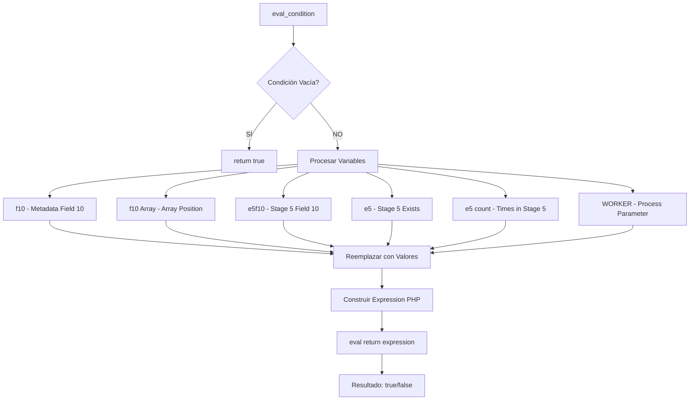

# DIAGRAMA: EVAL_CONDITION

## 🔍 Eval_condition - Evaluación de Condiciones

Copia este código en https://mermaid.live/



## 📋 Sintaxis de Variables:

| **Sintaxis** | **Significado** | **Ejemplo** |
|-------------|----------------|------------|
| `@f10` | Metadata field 10 del job actual | `@f10==200` |
| `@f10[0]` | Primera posición del array en field 10 | `@f10[0]=="OK"` |
| `@e5f10` | Metadata field 10 de la etapa 5 | `@e5f10!=0` |
| `@e5f10[2]` | Posición 2 del field 10 de la etapa 5 | `@e5f10[2]=="SF"` |
| `@e5` | ¿El job pasó por la etapa 5? | `@e5==true` |
| `@e5:count()` | Cuántas veces pasó por la etapa 5 | `@e5:count()>1` |
| `@e5f10:length()` | Longitud del array en field 10 de etapa 5 | `@e5f10:length()>5` |
| `@$$WORKER` | Parámetro del proceso | `@$$WORKER=="192.168.1.100"` |

## 🔑 Código clave:

```php
// jwf_common_functions.php línea 1049
function eval_condition(string $condition, array $job, array $metadata) {
    // Si condición vacía → true
    if ($condition == "") return true;
    
    // Reemplaza @f10 con valor real
    preg_match_all("/@f(\d+)/", $condition_segment, $fields_matches);
    foreach($fields_matches[0] as $i => $match){
        $result = fld($metadata, $fields_matches[1][$i]);
        $condition_segment = str_replace($match, $result, $condition_segment);
    }
    
    // Evalúa la expresión
    $evaluated = eval("return $new_expression;");
    return $evaluated;
}
```

## 💡 Ejemplos:

```php
// Condición: "@f10==200"
// Metadata: {10: 200}
// Proceso: "@f10==200" → "200==200" → eval("return 200==200;") → true

// Condición: "(@f10==200 && @f20=='SF') || @f30>100"
// Metadata: {10: 200, 20: 'AR', 30: 150}
// Proceso: "(200=='200' && 'AR'=='SF') || 150>100"
//          "(false && false) || true"
//          → true
```

