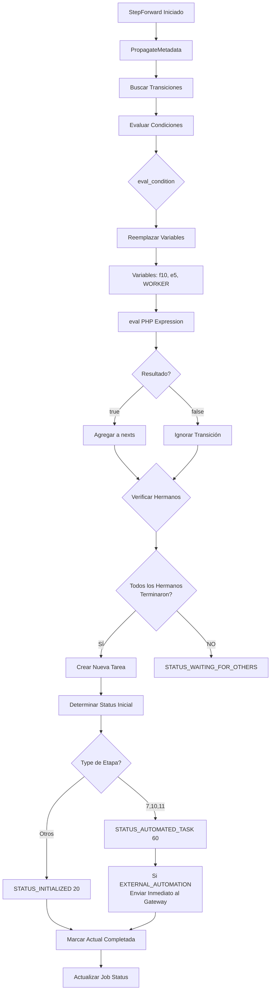

# DIAGRAMA: STEP FORWARD

## StepForward - Avance de Tareas

Copia este código en https://mermaid.live/



## Explicación:

1. **PropagateMetadata**: Copia metadata de tarea actual a siguiente
2. **Buscar Transiciones**: Lee todas las transiciones posibles desde stage actual
3. **Evaluar Condiciones**: Usa eval_condition para cada transición
4. **Verificar Hermanos**: Chequea si hay tareas paralelas esperando
5. **Crear Nueva Tarea**: INSERT en jwk_task
6. **Determinar Status**: 60 para automáticas, 20 para manuales
7. **Marcar Completada**: UPDATE status=30 en tarea actual
8. **Actualizar Job**: UPDATE jwjo_status

## Código clave:

```php
// jwf_common_functions.php línea 1165
function StepForward($job, $user, ...) {
    PropagateMetadata($job);
    
    foreach ($job["next_stages"] as $n) {
        $condition_result = eval_condition($condition, $job, $mvalue);
        if ($condition_result) {
            $nexts[] = array($to, $transition_group, $job_status, $from);
        }
    }
    
    // Crear nueva tarea
    INSERT INTO jwk_task (jwta_job, jwta_stage, jwta_status, ...)
    
    // Marcar actual completada
    UPDATE jwk_task SET jwta_status=30 WHERE jwta_id=...
}
```

